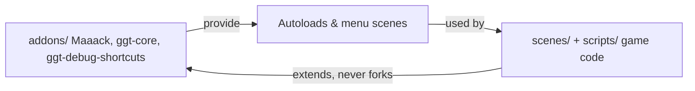
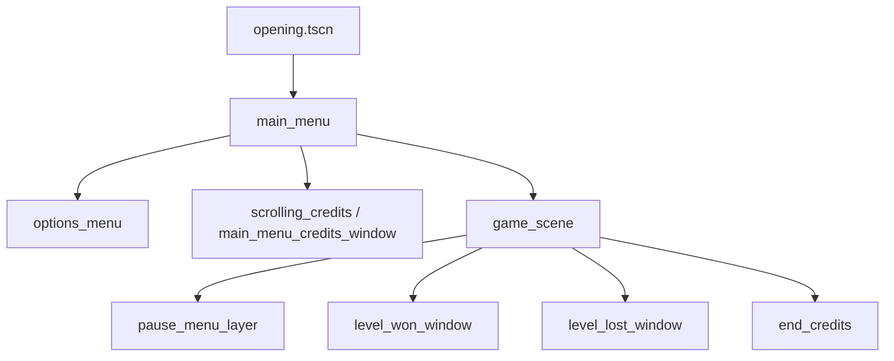

# System Patterns

## Architectural Principle: Template vs Game Code

- `addons/*` is treated as **upstream code**. Prefer not to edit.
- Project-specific flows live in `scenes/` and `scripts/`, composing addon-provided nodes and autoloads.
- If an addon bug must be fixed, document the change so future upstream pulls are predictable.

## Scene Flow

Typical runtime path driven by Maaack's template:

- `SceneLoader` autoload is the preferred way to change scenes with transitions/progress.
- `ProjectMusicController` / `ProjectUISoundController` own audio bus + UI sounds.

## State & Settings

- `AppConfig` owns runtime/app-level configuration.
- `UserSettings` (`res://scripts/autoloads/user_settings.gd`) owns user-facing persisted preferences.
- `GameState` / `LevelState` / `LevelAndStateManager` under `scripts/` coordinate in-game state for the example flow.

## Signals & Node Wiring

- Autoloads are globally reachable by name (`SceneLoader`, `GGT`, etc.); prefer calling their documented API over re-implementing.
- Scene-local wiring tends to use `@onready` lookups or `%UniqueName` references in Maaack-style scenes.
- Connect signals in a style consistent with neighboring files (all-in-code or editor-time) rather than mixing within one scene.

## Debug Tooling

- `GGT_DebugShortcuts` exposes editor-mapped input actions (`ggt_debug_restart_scene`, `ggt_debug_pause_game`, etc.) for fast iteration.
- Folder colors in `project.godot` visually segregate `addons/` (red), `assets/` (yellow), `resources/` (blue), `scenes/` (green), `scripts/` (orange).

## Naming & Conventions

- Scenes: `snake_case.tscn` matching their owning folder purpose (e.g. `scenes/credits/scrolling_credits.tscn`).
- Scripts: `snake_case.gd`; class-named scripts when they represent a real type.
- Keep hierarchies shallow; push behavior into small, composable nodes.

## Change-Management Patterns

- Prefer **extension over modification** for addons.
- When adding new autoloads, register in `project.godot` and document them in `tech_context.md`.
- When adding a new game flow, route navigation through `SceneLoader` so transitions remain consistent.
